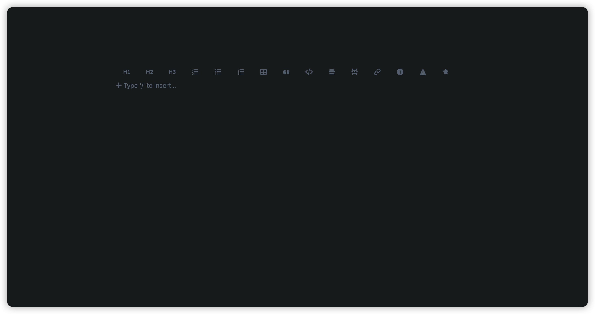

# with-toolbar
> inject toolbar for rich-markdown-editor

[](https://github.com/JiangWeixian/with-toolbar) [](https://github.com/JiangWeixian/with-toolbar)

<div align='center'>

  
*▲ with-toolbar*

</div>

## install

```console
yarn add with-toolbar rich-markdown-editor
```

## usage

```tsx
import RichMarkdownEditor from 'rich-markdown-editor'
import { withToolbar } from 'with-toolbar'

const Editor = withToolbar(RichMarkdownEditor)


function App() {
  return (
    <Editor />
  )
}

```